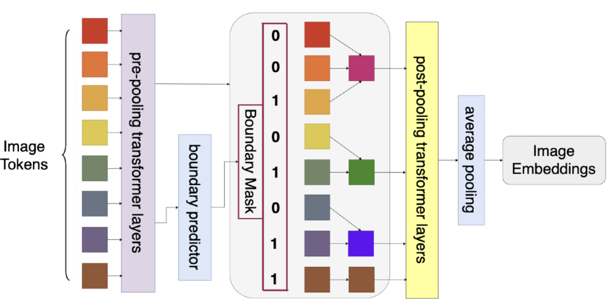
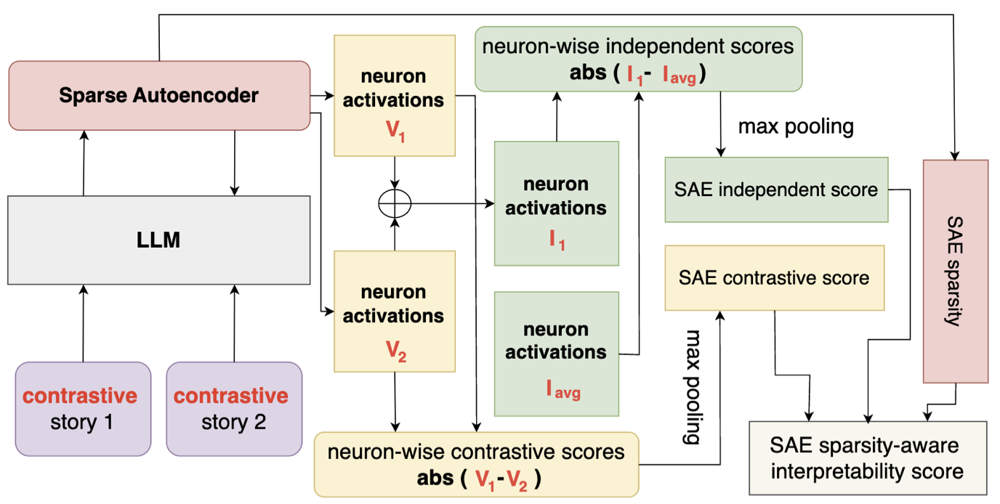

I am Yusen Peng, a final year undergraduate Computer Science and Engineering (CSE) student at The Ohio State University (OSU), graduating in Spring 2026.

My research interest is primarily **multimodality** with a specific focus on **efficiency**. I like to tackle this problem from two orthogonal perspectives:
- *data sparsity* - token pruning, token merging
- *weight sparsity* - low-rank approximation (SVD), MoE

Ongoing Projects ⭐️
======

  
  

    <h3 style="margin-top:0;">Dynamic Patch Pooling for Efficient Vision Transformers</h3>
    <strong>Yusen Peng</strong>, Sachin Kumar 
    <a href="https://github.com/Yusen-Peng/DRIP" target="_blank">[Github]</a>
  

Publications 🚀
======

  
  

    <h3 style="margin-top:0;">CE-Bench: Towards a Reliable Contrastive Evaluation Benchmark of Interpretability of Sparse Autoencoders</h3>
    Alex Gulko*, <strong>Yusen Peng*</strong>, Sachin Kumar. 
    <i>Proceedings of the 8th BlackboxNLP Workshop: Analyzing and Interpreting Neural Networks for NLP</i> 
    <a href="https://arxiv.org/abs/2509.00691" target="_blank">[Arxiv]</a> | 
    <a href="https://aclanthology.org/2025.blackboxnlp-1.1" target="_blank">[ACL Anthology]</a> |
    <a href="https://github.com/Yusen-Peng/CE-Bench" target="_blank">[Github]</a> |
    <a href="https://huggingface.co/datasets/GulkoA/contrastive-stories-v4" target="_blank">[HuggingFace]</a>
  

  
  

    <h3 style="margin-top:0;">CascadeFormer: A Family of Two-stage Cascading Transformers for Skeleton-based Human Action Recognition</h3>
    <strong>Yusen Peng</strong>, Alper Yilmaz. 
    <i>arXiv preprint 2025; under review at ICPR</i> 
    <a href="https://arxiv.org/abs/2509.00692" target="_blank">[Arxiv]</a> | 
    <a href="https://github.com/Yusen-Peng/CascadeFormer" target="_blank">[Github]</a> |
    <a href="https://huggingface.co/YusenPeng/CascadeFormerCheckpoints" target="_blank">[HuggingFace]</a> 
  

  
  

    <h3 style="margin-top:0;">pytskit: A Comprehensive Time Series Toolkit</h3>
    <!-- <strong>Yusen Peng</strong>  -->
    Fan Yang, <strong>Yusen Peng</strong>, Tomasz Frelek, Frank Li, Qiao Xiao, Mark Kikta, John Paparrizos 
    <i>Under review at JMLR</i> 
    <!-- <a href="" target="_blank">[paper (coming soon)]</a> |  -->
    [paper (coming soon)] | 
    <a href="https://github.com/thedatumorg/pytskit" target="_blank">[Github]</a>

  

  
  

    <h3 style="margin-top:0;">Data-adaptive SVD for Efficient Visual Geometry Learning</h3>
    <strong>Yusen Peng</strong>, Haoxuan Wang, Yan Yan  
    <i>preparing for ECCV 2026</i> 

    <!-- <a href="" target="_blank">[paper (coming soon)]</a> |  -->
    [paper (coming soon)] | 
    <a href="https://github.com/Yusen-Peng/SVD-Pi3" target="_blank">[Github]</a>
  

  
  

    <h3 style="margin-top:0;">Lower-quality public housing corresponds to elevated flood risk and social disadvantage</h3>
    Woi Sok Oh, Kelsea Best, Meri Davlasheridze, <strong>Yusen Peng</strong> 
    <i>Under review at Earth’s Future</i> 
    <a href="https://docs.google.com/document/d/1xQ40GUl8wWLM5I9q8T6M7Y-kDxelpi6-lIUt2vzz3KQ/edit?usp=sharing" target="_blank">[Paper]</a>
  

Undergraduate Thesis ✍️
======

  
  

    <h3 style="margin-top:0;">From Representation to Policy: Cascade Finetuning and Verifiable Reward Alignment for Human Action Understanding</h3>
    <strong>Yusen Peng</strong>, Alper Yilmaz  
    <i>Undergraduate Thesis</i> 
    <!-- <a href="" target="_blank">[paper (coming soon)]</a> |  -->
    [paper (coming after defense)]
    <!-- <a href="https://github.com/Yusen-Peng/CascadeFormer2" target="_blank">[Github]</a> -->
  

Awards 🏅
======

* **Honorable Mention, CRA Outstanding Undergraduate Researcher Award (2025)**
  * by Computing Research Association (CRA)

* **Undergraduate Research Scholarship 2025 @ OSU**
  * $2,200 scholarship awarded based on my Honors Thesis proposal @ OSU

Academic Service 📚
======

* **Conference Reviewer** @ NeurIPS
  * reviewed 3 papers at [NeurIPS 2025 Mechanistic Interpretability Workshop](https://mechinterpworkshop.com)

