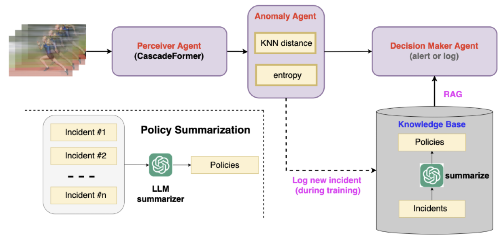

Who Am I? 👀
======
I am Yusen Peng, a final year undergraduate Computer Science and Engineering (CSE) student at The Ohio State University (OSU), graduating in May 2026. 

During my time at OSU, I have maintained **4.00**/4.00 cumulative GPA and completed advanced AI courses including Natural Language Processing, Computer Vision, Machine Learning, and Data Mining. In addition, I am also graduating with **Honors Research Distinction**, where I was awarded with **Undergraduate Research Scholarship** this year based on my Honors Thesis proposal.

Research Interest 🧠
======

My primary research interests lie in **vision-language models**. I always investigate different approaches to
designing such models with the emphasis on the following three aspects:
1. **Capability**: design robust, generalizable vision-language models that are data-adaptive and task-versatile
2. **Efficiency**: engineer computational efficient vision-language models with good performance tradeoffs
3. **Interpretability**: develop transparent vision-language models that explain their decision-making process

Publications 🚀
======

  
  

    <h3 style="margin-top:0;">CE-Bench: A Contrastive Evaluation Benchmark of Interpretability with Sparse Autoencoders</h3>
    Alex Gulko*, <strong>Yusen Peng*</strong>, Sachin Kumar. 
    <i>EMNLP 2025 Workshop BlackboxNLP</i> 
    <a href="https://arxiv.org/abs/2509.00691" target="_blank">[Arxiv]</a> | 
    <a href="https://github.com/Yusen-Peng/CE-Bench" target="_blank">[Github]</a>
  

  
  

    <h3 style="margin-top:0;">CascadeFormer: A Family of Two-stage Cascading Transformers for Skeleton-based Human Action Recognition</h3>
    <strong>Yusen Peng</strong>, Alper Yilmaz. 
    <i>arXiv preprint</i>; also under review at ICLR 2026 
    <a href="https://arxiv.org/abs/2509.00692" target="_blank">[Arxiv]</a> | 
    <a href="https://github.com/Yusen-Peng/CascadeFormer" target="_blank">[Github]</a>
  

  
  

    <h3 style="margin-top:0;">Lower-quality public housing corresponds to elevated flood risk and social disadvantage</h3>
    Woi Sok Oh, Kelsea Best, Meri Davlasheridze, <strong>Yusen Peng</strong> 
    <i>Under review at Earth’s Future</i>, 2025 
    <a href="https://docs.google.com/document/d/1xQ40GUl8wWLM5I9q8T6M7Y-kDxelpi6-lIUt2vzz3KQ/edit?usp=sharing" target="_blank">[Paper]</a>
  

Ongoing Projects ⭐️
======

  
  

    <h3 style="margin-top:0;">DRIP: Dynamic token Reduction vIsion transformer via Pooling for efficient multimodal learning</h3>
    <strong>Yusen Peng</strong>, Sachin Kumar  
    <a href="https://github.com/Yusen-Peng/DRIP" target="_blank">[Github]</a>
  

  
  

    <h3 style="margin-top:0;">SVD-π3: Efficient Visual Geometry Learning via Singular Value Decomposition</h3>
    Mentor: Haoxuan Wang; Advisor: Dr. Yan Yan | August 2025 - Present  
    <a href="https://github.com/Yusen-Peng/SVD-Pi3" target="_blank">[Github]</a>
  

  
  

    <h3 style="margin-top:0;">CascadeFormer-based Agentic Anomaly Detection for Surveillance Purpose</h3>
    Advisor: Dr. Alper Yilmaz | August 2025 - Present  
    <a href="https://github.com/Yusen-Peng/CascadeFormer-AD-Agent" target="_blank">[Github]</a>
  

Academic Service 📚
======

* **Conference Reviewer** @ NeurIPS
  * reviewed 3 papers at [NeurIPS 2025 Mechanistic Interpretability Workshop](https://mechinterpworkshop.com)

Campus Poster Presentations 👨‍👨‍👦‍👦
======

* **SIGNAL: A Comprehensive Time Series Analysis Library**
  * The DATUM Lab \| Advisor: Dr. John Paparrizos; 
  * [Poster](https://drive.google.com/file/d/1WV9PNwhTVWQE94SSKilK8oGx4dYKENP-/view?usp=sharing) resented at the CSE Annual Research Expo 2025 at The Ohio State University

* **A Comparison of CSV, HDF5, Zarr, and netCDF4 in Performing Common I/O Operations**
  * Advisor: Dr. Suren Byna; [GitHub](https://github.com/Yusen-Peng/File-IO-Benchmark)
  * [Poster](https://drive.google.com/file/d/1Q3U9HihDamZp9HKgECZaG2mGMs0BFeRe/view) presented at the CSE Annual Research Expo 2024 at The Ohio State University

AI/ML Competitions 🏅
======

* **NASA Airport Throughput Prediction Challenge 2024** (Top 10 Finalist)
  * Ranked **9th** out of **51 teams** in the final [Leaderboard](https://bitgrit.net/competition/23)

Teaching 🧑🏻‍🏫
======

* Teaching Assistant for CSE 2331: **Data Structures and Algorithms** (Aug 2024 – Present)

* Teaching Assistant for CSE 2221: **Software Components** (Aug 2023 – Dec 2023)

Internships 👨‍💻
======

* Software Engineer Intern @ **Thaddeus Resource Center** (May 2025 – Present)

* Software Engineer Intern @ **Y STEM and Chess Inc** (Jan 2025 – Apr 2025)

* Website Frontend Intern @ **National STEM Honor Society** (May 2024 – Sept 2024)

* Mobile Frontend Intern @ **Resilience, Inc** (Dec 2023 – Aug 2024)

Extra-curriculars 🔮
======

* **Competitive Programming Club (CPC)** @ The Ohio State University
  * Served as 23-24 **Problem Engineer** and 24-25 **Communication Director**
